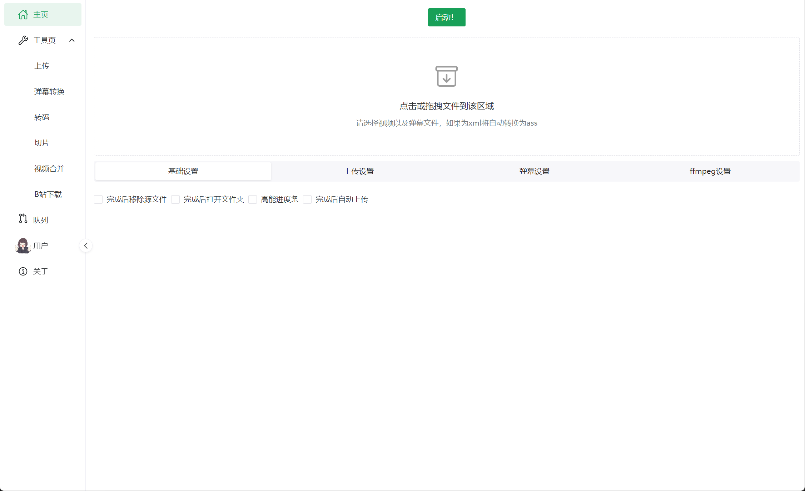

# biliLive-tools

这是一个直播的一站式工具，支持弹幕转换与视频压制并上传至B站，支持斗鱼、虎牙、B站、抖音直播录制，支持[B站录播姬](https://github.com/BililiveRecorder)、[blrec](https://github.com/acgnhiki/blrec)、[DDTV](https://github.com/CHKZL/DDTV)的webhook。  
如果你是录播man正在寻找xml弹幕转换、弹幕压制、webhook上传工具，如果你是切片man正在寻找下载录播视频工具，如果你厌倦了b站的多p上传，你可以来试试本软件。  
做这款工具的初衷是为了解决录播工具的碎片化，往往想完整处理一场带有弹幕的录播要使用多个软件的配合，一些工具只有CLI，加大了使用难度。  
软件的目标是开箱即用，体验优先，默认配置下满足大部分人使用需求，同时支持个性化需求来增加可用性。  
你可以在B站查看[系列教程](https://www.bilibili.com/video/BV1Hs421M755/)

# 功能介绍

- 支持斗鱼、虎牙、B站、抖音多平台直播录制，支持ffmpeg、mesio、录播姬多种录制引擎，支持弹幕录制及更多高级选项
- 支持录播姬、blrec、DDTV、onelivrec等多个平台的webhook自动化处理
- 支持录制文件自动压制弹幕、B站上传、同步至网盘
- 支持任意录制平台基于文件监听的自动化支持
- 支持基于Danmakufactory的现代化XML文件转ASS的GUI
- 支持利用弹幕及高能点进行视频粗剪
- 支持批量进行视频压制、转码、合并、FLV文件修复
- 支持自动下载搬运斗鱼、虎牙录播至B站
- 支持下载斗鱼、虎牙、B站、快手的直播录像
- 支持多种类型的通知

**如果你使用了本软件，希望你在简介标注仓库地址或保留默认tag，本软件不存在任何数据追踪，我想大致知道使用使用人群及情况**

# 在线文档

文档地址：https://docs.irenmu.com

# 更新历史

[更新历史](https://github.com/renmu123/biliLive-tools/blob/master/CHANGELOG.md)

# 安装

客户端可直接在 [release](https://github.com/renmu123/biliLive-tools/releases) 中下载，更多内容见[文档](https://docs.irenmu.com/guide/installation.html)

# 交流地址

交流 QQ 群：872011161

# 开发

具体见内容 [文档](https://docs.irenmu.com/development/guide.html)

## 关于PR

提 PR 前，最好先提一个 issue，以防重复或者 PR 不被接收

## WebUI项目地址

为github actions自动编译

地址：https://github.com/renmu123/biliLive-webui

# 赞赏

如果本项目对你有帮助，请我喝瓶快乐水吧，有助于项目更好维护。  
爱发电：[https://afdian.com/a/renmu123](https://afdian.com/a/renmu123)  
你也可以给我的 B 站帐号 [充电](https://space.bilibili.com/10995238)

# License

GPLv3

# 参考资料 & 鸣谢

<ul>
  <li>
    <a href="https://github.com/hihkm/DanmakuFactory" class="external" target="_blank"
      >DanmakuFactory</a
    >
  </li>
  <li>
    <a href="https://github.com/biliup/biliup-rs" class="external" target="_blank"
      >biliup-rs</a
    >
  </li>
  <li>
    <a
      href="https://github.com/BililiveRecorder/BililiveRecorder"
      class="external"
      target="_blank"
      >BililiveRecorder</a
    >
  </li>
  <li>
    <a href="https://github.com/renmu123/biliAPI" class="external" target="_blank">biliAPI</a>
  </li>
  <li>
    <a href="https://github.com/WhiteMinds/LiveAutoRecord" class="external" target="_blank"
      >LiveAutoRecord</a
    >
  </li>
</ul>
