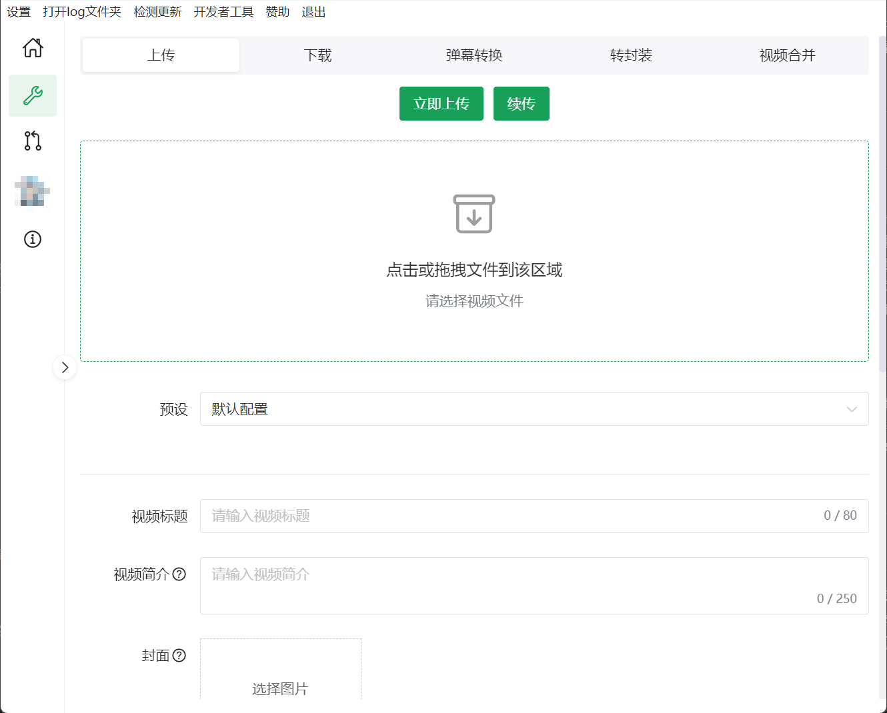

# biliLive-tools


这是一个直播的一站式工具，支持弹幕转换与视频压制并上传至B站，支持斗鱼、虎牙、B站、抖音直播录制，支持[B站录播姬](https://github.com/BililiveRecorder)、[blrec](https://github.com/acgnhiki/blrec)、[DDTV](https://github.com/CHKZL/DDTV)的webhook。  
如果你是录播man正在寻找xml弹幕转换、弹幕压制、webhook上传工具，如果你是切片man正在寻找下载录播视频工具，如果你厌倦了b站的多p上传，你可以来试试本软件。  
做这款工具的初衷是为了解决录播工具的碎片化，往往想完整处理一场带有弹幕的录播要使用多个软件的配合，一些工具只有CLI，加大了使用难度。  
软件的目标是开箱即用，体验优先，默认配置下满足大部分人使用需求，同时支持个性化需求来增加可用性。  
你可以在B站查看[系列教程](https://www.bilibili.com/video/BV1Hs421M755/)

**如果你使用了本软件，希望你在简介标注仓库地址或保留默认tag，本软件不存在任何数据追踪，我想大致知道使用使用人群及情况**

[更新历史](https://github.com/renmu123/biliLive-tools/blob/master/CHANGELOG.md)

1. 支持录播姬与blrec的webhook自动化处理
2. 支持 Danmafactory GUI 弹幕xml转换
3. 支持根据弹幕切片
4. 支持b站分P投稿
5. 支持视频与弹幕压制
6. 支持 ffmpeg 转码及转封装（含非标flv下的hevc）
7. 支持B站视频、斗鱼、虎牙录播及其弹幕下载
8. 支持斗鱼、虎牙、B站、抖音直播录制



# 安装

**任何版本更新前请查看更新记录，避免破坏性更新带来的问题**

最优先支持的是桌面程序，其余或多或少缺失了部分功能

## 桌面程序

不提供 MacOS 安装包，需要的可以自行编译，编译时需要替换用到的二进制文件。  
由于我不在Linux开发，测试覆盖不广，如果存在问题可以提issue。

下载地址：https://github.com/renmu123/biliLive-tools/releases  
备用下载地址：https://pan.quark.cn/s/6da253a1ecb8

## CLI

CLI的使用参考[文档](https://github.com/renmu123/biliLive-tools/tree/master/packages/CLI)

也可以使用`npm i bililive-cli -g`来进行安装

## docker

**由于软件并非针对web设计，无法保证安全性，请谨慎暴露在公网中**

你可以通过运行`docker-compose up -d`来快速搭建，也可以查看[视频教程](https://www.bilibili.com/video/BV1HVd5YdEGh)

```yaml
services:
  # UI镜像
  webui:
    image: renmu1234/bililive-tools-frontend
    ports:
      - "3000:3000"
  # 接口镜像
  api:
    image: renmu1234/bililive-tools-backend
    ports:
      - "18010:18010"
    volumes:
      # 映射的配置目录，用于持久化配置文件
      - ./data:/app/data
      # 存储文件的默认目录
      - ./video:/app/video
      # 字体目录
      - ./fonts:/usr/local/share/fonts
    environment:
      # 登录密钥
      - BILILIVE_TOOLS_PASSKEY=your_passkey
      # 账户加密密钥
      - BILILIVE_TOOLS_BILIKEY=your_bilikey
      # 中国时区
      - TZ=Asia/Shanghai
```

具体支持的环境变量见[文档](./README.md#支持的环境变量)

### webhook

docker下由于存储和网络的隔离，webhook使用其他安装方式并不完全一致，我们这里以录播姬为例，其他服务类似：

运行之后打开录播姬的配置webhookV2为`http://api:18010/webhook/bililiverecorder`，无须在软件中设置“录播姬工作目录”

```yaml
services:
  # UI镜像
  webui:
    image: renmu1234/bililive-tools-frontend
    ports:
      # 前者按需改动
      - "3000:3000"
  # 接口镜像
  api:
    image: renmu1234/bililive-tools-backend
    ports:
      - "18010:18010"
    volumes:
      # 映射的配置目录，用于持久化配置文件
      - ./data:/app/data
      # 用于处理webhook数据，按需修改，与录播姬的参数一致
      - ./video:/app/video
      # 字体目录
      - ./fonts:/usr/local/share/fonts
    environment:
      # 登录密钥，自行修改
      - BILILIVE_TOOLS_PASSKEY=your_passkey
      # 账户加密密钥，自行修改
      - BILILIVE_TOOLS_BILIKEY=your_bilikey
      # 中国时区
      - TZ=Asia/Shanghai
  # 录播姬
  recorder:
    image: bililive/recorder:latest
    restart: unless-stopped
    volumes:
      # 用于处理webhook数据，按需修改，和上述参数一致
      - ./video:/rec
    ports:
      - "2356:2356"
      # 第一个 2356 是宿主机的端口，可以根据自己需求改动。
      # 第二个 2356 是容器内的端口，不要修改。
    environment:
      - BREC_HTTP_BASIC_USER=用户名
      - BREC_HTTP_BASIC_PASS=密码
      # 更多参数见录播姬文档
```

### 硬件编码

#### Intel核显(qsv)

可以参考 [#59](https://github.com/renmu123/biliLive-tools/issues/59)

## webui

可用于国内未备案机器，或懒得自部署的情况，如果你的接口是http协议，由于浏览器安全措施，需要关闭https和http混合的安全选项，或者自部署，自部署参考[项目](https://github.com/renmu123/biliLive-webui)

密钥为`appConfig.json`的`passKey`字段。

不会保证web的兼容性，请自行保证网页端与服务端版本一致，浏览器兼容性为最新chrome版本

线上地址：https://bililive.irenmu.com

# 功能介绍

## 直播录制

| 平台 | 弹幕 | 画质 | 线路 | Cookie | 流格式 | 流编码 | 只音频 |
| ---- | ---- | ---- | ---- | ------ | ------ | ------ | ------ |
| 斗鱼 | ✅   | ✅   | ✅   | ❌     | ❌     | ❌     | ✅     |
| B站  | ✅   | ✅   | ❌   | ✅     | ✅     | ✅     | ✅     |
| 抖音 | ✅   | ✅   | ❌   | ✅     | ✅     | ❌     | ✅     |
| 虎牙 | ✅   | ✅   | ✅   | ❌     | ❌     | ❌     | ❌     |

1. 支持B站、斗鱼、虎牙、抖音三平台录制，包含弹幕和礼物，B站额外支持舰长以及SC，斗鱼支持高能弹幕
2. 以最小的文件大小支持最全的danmakufactory兼容性
3. B站录制支持所有流，以及批量查询接口
4. 更加快捷的加入软件中的自动化视频压制与自动上传

目前支持斗鱼、虎牙、B站、抖音几个平台，**除非我有需求，否则不会增加更多平台，支持PR**，支持录制弹幕及礼物，斗鱼和B站额外支持高能弹幕。

最优先维护斗鱼、其次B站、虎牙和抖音随心

实现由 [LiveAutoRecord](https://github.com/WhiteMinds/LiveAutoRecord) 拓展而来

## webhook

### [B站录播姬](https://github.com/BililiveRecorder)

默认webhook地址：http://127.0.0.1:18010/webhook/bililiverecorder

**需要在本软件的“设置-webhook-录播姬工作目录”设置录播的工作目录**

### [blrec](https://github.com/acgnhiki/blrec)

默认webhook地址：http://127.0.0.1:18010/webhook/blrec

**依赖于“视频文件创建”,“视频文件完成”两个webhhook，建议直接勾选全部事件。**

### [DDTV](https://github.com/CHKZL/DDTV)

默认webhook地址：http://127.0.0.1:18010/webhook/ddtv

需要将DDTV的软件“设置-文件与路径设置-录制文件保存路径”设置为绝对路径，打开弹幕录制。

由于DDTV的webhook返回参数的非常扭曲~~难用~~，无法保证任意配置下的可用性

### 自定义Webhook

如果想接入webhook相关功能，你可以自行构造参数并调用接口，采用`post`方法，端口为`/webhook/custom`，接收后立刻返回http code=200。

参数：
`event`: `FileClosed`|`FileOpening` (如果你想使用断播续传功能，请在上一个`FileClosed`事件后在设置的时间间隔内发送`FileOpening`事件)  
`filePath`: 视频文件的绝对路径
`coverPath`: 可选，视频封面的绝对路径，如果为空，会读取与视频文件名相同的后缀为`jpg`的文件
`danmuPath`: 可选，视频弹幕`xml`文件，如果为空，会读取与视频文件名相同的`xml`文件
`roomId`: 数字类型，房间号，用于断播续传  
`time`: 用于标题格式化的时间，示例："2021-05-14T17:52:54.946"  
`title`: 标题，用于格式化视频标题  
`username`：主播名称，用于格式化视频标题

**以下参数用于弹幕分析功能，非必要**
有些弹幕中存在元数据(参考blrec)的会被自动解析，比如弹幕姬或blrec或douyu-cli(0.6.1及以上)生成的弹幕
`platform`：平台，如果是b站推荐为`bilibili`，斗鱼推荐为`douyu`，其实填啥都可以  
`live_start_time`：直播开始时间，示例："2021-05-14T17:52:54.946"
`live_title`：直播标题

示例：

```bash
curl --location 'http://127.0.0.1:18010/webhook/custom' \
--header 'Content-Type: application/json' \
--data '{
    "event":"FileClosed",
    "filePath":"D:\\aa.mp4",
    "coverPath":"D:\\aa.jpg",
    "danmuPath":"D:\\aa.xml",
    "roomId":93589,
    "time":"2021-05-14T17:52:54.946",
    "title":"我是猪",
    "username":"djw"
}'
```

## 断播续传

这个功能主要用于解决：由于网络或者设置分段原因导致录播片段被切割成多个。  
开启后，会将主播的一场直播上传到同一个视频中  
一场直播的定义：同一个主播，本次文件创建时间与上一个文件结束写入时间如果相差n分钟（使用配置），那么会被定义为一场直播，不会使用webhook中比如录播姬的session定义。  
开启录制后，或反复切换开关，可能会有奇怪的错误。

## xml弹幕转换

xml弹幕转换底层使用[DanmakuFactory](https://github.com/hihkm/DanmakuFactory)，B站弹幕确认可以使用，其余类型请自行测试。  
部分功能如自适应分辨率

## 切片功能

支持通过弹幕以及高能进度条来快速找到你所需要的片段，支持导入[lossless-cut](https://github.com/mifi/lossless-cut)项目

### 支持哪些快捷键

- `ctrl+s` 保存到llc项目
- `ctrl+shift+s` 另存为llc项目
- `ctrl+enter` 导出
- `ctrl+z` 撤销
- `ctrl+shift+z` 重做
- `I` 在当前时间开始当前片段
- `O` 在当前时间结束当前片段
- `up` 上一个片段
- `down` 下一个片段
- `del` 删除片段
- `space` 播放/暂停
- `ctrl+left` 后退1秒
- `ctrl+right` 前进1秒
- `ctrl+k` 唤起弹幕搜索
- `ctrl+shift+k` 关闭弹幕搜索

## 通知

**使用通知功能时，请妥善保存所有信息，请勿分享给他人，本软件不会发送任何信息到任何服务器**

### 邮箱

使用smtp服务来发送邮件，每个邮件服务商的参数各不相同，使用请自行参照各服务商的教程。

### server酱

serer酱支持免费推送信息到手机微信，免费账户有限制。

官网：https://sct.ftqq.com/

### tg bot

tg bot 的搭建请自行寻找教程

### ntfy

官网：https://docs.ntfy.sh/

### push-all-in-cloud

这是一个支持多种推送方式的工具，可以让你统一管理推送以及减少在客户端暴露相关key的机会

项目地址：https://github.com/CaoMeiYouRen/push-all-in-cloud

## 同步

### 如何使用

打开“设置-文件同步”选择你需要的同步的网盘，**使用前请仔细查看相关文档**，客户端需配置二进制包，并进行登录等相关操作。

之后去“同步器”中增加一个你需要使用的同步器，并设置相关配置。

去“webhook”配置中为需要同步的直播间设置“同步器”配置

### BaiduPCS-Go(百度网盘)

项目地址：https://github.com/qjfoidnh/BaiduPCS-Go

测试版本：3.9.7

### aliyunpan(阿里云盘)

项目地址：https://github.com/tickstep/aliyunpan

测试版本：0.3.7

### alist

项目地址：https://alistgo.com

# 常见问题

## 支持的环境变量

windows下环境变量修改后可能需要重启电脑方能生效

### B站登录自定义密钥加密

可以使用环境变量`BILILIVE_TOOLS_BILIKEY`自定义账号密钥，自定义前请先退出原有全部账号。

### 鉴权密钥

通过环境变量`BILILIVE_TOOLS_PASSKEY`自定义登录密钥

## Webhook标题模块引擎如何使用

1.5.0起 Webhook 标题支持[ejs模板引擎](https://github.com/mde/ejs)，具体语法参考文档，**如果标题超过80字，会被自动截断**，会优先执行模板引擎，之后会对`{{}}`占位符进行替换，如果有语法错误，会被跳过，优先保证上传。

```ts
// 以下为支持注入的参数
{
  title: string; // 直播间标题
  user: string; // 主播名称
  time: Date; // 直播开始时间
  roomId: number | string; // 房间号
}
```

示例：`<%= user %>-<%= time.getFullYear() %><%= String(time.getMonth() + 1).padStart(2, "0") %>直播录像`
渲染结果：`djw-202408直播录像`

## 压制预设如何设置

~~我也不知道~~  
如果你是一个小白，先根据自己的硬件选择对应的编码，推荐使用crf或cq等质量模式的默认参数，压制后查看视频大小，压制时间，画质，接下来调整参数，以满足你的需求，没有最好的参数，只有最合适的参数，不同视频，不同场景可能合适的参数都不一致。  
进阶请自行搜索ffmpeg相关的教程

## nvnec或其他硬件转码无法正常使用

请尝试更新显卡驱动，如果更新到最新后还无法使用，请尝试手动更换ffmpeg可执行文件为6.0，自定义后部分功能可能会无法使用

## blrec开启转换为mp4后无法使用

请关闭该功能，使用本软件的“转封装为mp4”功能

## 有时上传和下载任务点击暂停无效

上传任务分为三个阶段，只有第二个阶段是支持暂停的：

1. 获取上传基础信息
2. 文件切片上传
3. 文件合并，调用提交接口

下载任务分为三个阶段，只有第二个阶段是支持暂停的：

1. 获取下载文件基础信息
2. 文件切片下载
3. 文件合并

## 怎么评估压制的速度

进入队列，查看任务最后一栏的速率，可以根据速率调整压制参数

## 如何查看原始ffmpeg命令输出

压制之后查看log

## 最大任务数

1. 手动暂停的任务不会被自动启动
2. 高能进度条任务会自动进行，因为速度会很快

## 使用zip包后安装包无法使用

zip包并非传统意义上的绿色包，数据和安装包文件的不会存放在同一个文件夹中，如果你尝试使用安装包后使用压缩包，可能会导致二进制文件的路径错误从而无法使用，请尝试在设置中手动修改二进制文件路径。

如果你想将数据放在同一个文件夹内，请在可执行文件所在文件夹创建一个`portable`文件，无拓展名如`.txt`，更改后重启应用，如有需要可以新建文件前在设置中备份设置。

## 更改部分配置不生效

绝大部分配置修改后生效、某部分配置只对当场直播生效、小部分配置重启后生效

## 频繁上传失败怎么办

1. 升级软件到最新版本
2. 增加重试次数和时间
3. 尝试手动选择并测试上传路线
4. 尝试关闭ipv6
5. 尝试手动修改dns

## 如何备份文件

目前有两种方式备份恢复文件，导入后重启应用生效，尽量保持版本一致：

1. 打开设置，点击“导出配置”，在需要恢复时点击“导入配置”，如果这种方式失败，请尝试使用第第二种方式进行手动备份
2. 找到配置文件夹，找到`appConfig.json`、`presets.json`、`danmu_presets.json`、`ffmpeg_presets.json`，如果你还想备份封面，找到`cover`文件夹，恢复时直接覆盖即可

## 字体问题

web和客户端使用的字体方式并不相同，会有差异，再加上获取字体 `postscriptName` 的微妙的有些不同，导致某些字体web中选择后无法使用。

docker下的emoji文本渲染错误，猜测和fontconfig有关，但是我不会改，如果你会欢迎发issue

## 显示的上传下载速度不准确

所有相关速度仅限参考~

## 抖音双屏录播分割主画面

假设你已经开始“双屏直播流选项”，主画面的分辨率为1920x1080。

在 `ffmpeg设置` 的 `视频滤镜` 中输入 `crop=1920:1080:0:0;$origin`，即可分离出主画面，副画面同理

## 录制如何为不同直播间配置不同存储路径

支持为 `文件命名规则` 配置项支持了 [ejs](https://ejs.co/) 模板引擎，你可以将 `保存文件夹` 置空，将保存路径及命名规则，全部配置在 `文件命名规则` 配置项中。**修改后及时进行测试**

参考示例：斗鱼与其他站点保存在不同盘符中  
`<% if (platform=='斗鱼') { %>C<% } %><% if (platform!='斗鱼') { %>D<% } %>:\录制\{platform}/{owner}/{year}-{month}-{date} {hour}-{min}-{sec} {title}`

# TODO

- [x] 支持使用ffmpeg压制弹幕至视频文件
- [ ] 工具页面
  - [x] 支持ffmpeg不同cpu，gpu以及相关配置
  - [x] 支持使用danmufactory自动处理xml文件并进行压制
  - [x] 工具页面，danmufactory的GUI
  - [x] 工具页面，flv的转封装
  - [x] 支持视频合并
  - [x] 下载页面
  - [x] 支持切片
- [x] log记录及其展示
- [x] 配置持久化，压制高能进度条
- [x] B站上传支持
  - [x] 移除biliup二进制文件依赖
  - [x] 支持分p
  - [x] 多账户支持
- [ ] webhook支持
  - [x] 录播姬webhook支持
  - [x] blrec webhook支持
  - [x] 支持自动上传
  - [x] 支持弹幕压制
  - [x] 断播续传
- [x] 支持自定义ffmpeg以及ffprobe
- [ ] 直播录制
  - [x] 斗鱼
  - [x] 虎牙
  - [x] B站
  - [x] 抖音
- [ ] 弹幕分析&看板支持
- [x] 支持斗鱼&虎牙录播自动搬运
- [x] web&docker版本支持

# 交流地址

交流 QQ 群：872011161

# 开发

node版本根据`.node-version`来进行选择

## Install

```bash
$ pnpm install
$ pnpm run install:bin
```

### better-sqlite3

`弹幕分析`功能依赖于`better-sqlite3`，如果你无法编译安装，尝试安装[visual-studio2022](https://visualstudio.microsoft.com/zh-hans/thank-you-downloading-visual-studio/?sku=Community)中的c++相关工具，以及python3(也许)。
如果你是Win，你还可能遇到报错比如`cause=fork/exec %1 is not a valid Win32 application.`，根据[提示](https://github.com/pnpm/pnpm/issues/5638#issuecomment-1327988206)修改pnpm源文件，如果你最后还是无法安装，尝试在项目根目录运行`node scripts\github-ci-better-sqlite3.js`手动安装依赖。

### 其他依赖

如果二进制依赖安装失败或者不支持你的平台，请尝试[手动下载安装](https://github.com/renmu123/biliLive-tools/releases/tag/0.2.1)二进制依赖，最新版本为距离当前版本最近的版本。

新建`packages\app\resources\bin`文件夹，里面需要三个文件。
同时需要在应用的设置里设置相关可执行文件地址。

1. `DanmukuFactory.exe` [自编译版本](https://github.com/renmu123/DanmakuFactory/tree/test)
2. `ffmpeg.exe` [n7.0](https://github.com/BtbN/FFmpeg-Builds/releases)
3. `ffprobe.exe` [n7.0](https://github.com/BtbN/FFmpeg-Builds/releases)

## Development

`pnpm run dev`

## 关于PR

提 PR 前，最好先提一个 issue，以防重复或者 PR 不被接收

## Build

```bash
# APP应用，如果需要分发也可以在github action进行自动编译
$ pnpm run build:app
# CLI应用
$ pnpm run build:cli
# docker
# 相关文件在`docker`文件夹下
```

## WebUI项目地址

为github actions自动编译

地址：https://github.com/renmu123/biliLive-webui

## 直播录制相关库

- [录制管理](https://www.npmjs.com/package/@bililive-tools/manager)
- [B站录制](https://www.npmjs.com/package/@bililive-tools/bilibili-recorder)
- [斗鱼录制](https://www.npmjs.com/package/@bililive-tools/douyu-recorder)
- [虎牙录制](https://www.npmjs.com/package/@bililive-tools/huya-recorder)
- [抖音录制](https://www.npmjs.com/package/@bililive-tools/douyin-recorder)
- [虎牙弹幕监听](https://www.npmjs.com/package/huya-danma-listener)
- [抖音弹幕监听](https://www.npmjs.com/package/huya-danma-listener)

# 赞赏

如果本项目对你有帮助，请我喝瓶快乐水吧，有助于项目更好维护。  
爱发电：[https://afdian.com/a/renmu123](https://afdian.com/a/renmu123)  
你也可以给我的 B 站帐号 [充电](https://space.bilibili.com/10995238)

# License

GPLv3

# 参考资料 & 鸣谢

<ul>
  <li>
    <a href="https://github.com/hihkm/DanmakuFactory" class="external" target="_blank"
      >DanmakuFactory</a
    >
  </li>
  <li>
    <a href="https://github.com/biliup/biliup-rs" class="external" target="_blank"
      >biliup-rs</a
    >
  </li>
  <li>
    <a
      href="https://github.com/BililiveRecorder/BililiveRecorder"
      class="external"
      target="_blank"
      >BililiveRecorder</a
    >
  </li>
  <li>
    <a href="https://github.com/renmu123/biliAPI" class="external" target="_blank">biliAPI</a>
  </li>
  <li>
    <a href="https://github.com/WhiteMinds/LiveAutoRecord" class="external" target="_blank"
      >LiveAutoRecord</a
    >
  </li>
</ul>
