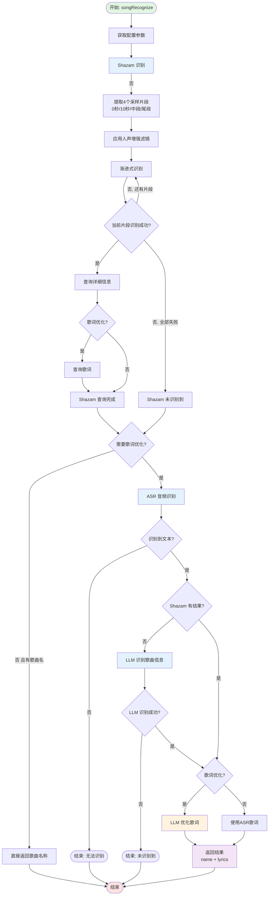

# 介绍

## 初始化

设置默认添加了千问的供应商，你仅需要配置key即可开始使用，首先查看[官方文档](https://help.aliyun.com/zh/model-studio/first-api-call-to-qwen)进行注册，拿到key后在“设置->AI配置->供应商”阿里云中并配置相关的key，由于我主要使用qwen进行开发，其他模型的兼容性未经过测试，如果有更多模型的支持，欢迎PR

接下来会介绍相关的一些功能。

## 歌切

位于切片右键选项中，为了此功能而引入的AI，目标是更快更好得识别音乐名称以及生成歌词

#### 流程图

## 字幕识别

位于切片右键选项中，目标就是为切片生成字幕了，逻辑也十分简单，将片段音频喂给asr引擎，拿到词级时间戳进行排版

### ffmpeg 的 Whisper 支持

由于 ffmpeg8.0 支持了[whispercpp](https://github.com/ggml-org/whisper.cpp)，但是本软件支持的只是7.1，由于8.0要求的cuda版本较高可能造成大量n卡硬件编码错误，所有软件本体的ffmpeg版本暂时不会更新。

但我仍然为想要使用的用户提供了渠道，只是需要一些额外的配置。

第一步的相关你也可以直接在[夸克网盘](https://pan.quark.cn/s/6da253a1ecb8)下载。

不推荐在歌词识别中使用~~当然你也识别不出什么~~，如果出现什么不能使用gpu加速也别来问我，我也不知道

#### 配置步骤

1. **下载 ffmpeg 8.0 和 Whisper 模型**
   - 下载 ffmpeg 8.0 版本（或从[夸克网盘](https://pan.quark.cn/s/6da253a1ecb8)获取）
   - 下载 Whisper 模型文件（[huggingface.co/ggerganov/whisper.cpp](https://huggingface.co/ggerganov/whisper.cpp)）
   - **推荐使用大参数模型**（如 `ggml-large-v3.bin`）以获得更好的识别效果
   - **后两步的路径中如包含空格或一些奇怪字符，可能会导致无法使用**

2. **配置供应商**
   - 打开：设置 -> AI配置 -> 供应商
   - 点击"添加供应商"
   - **供应商类型**：选择 `ffmpeg`
   - **配置名称**：自定义名称（如 "FFmpeg Whisper"）
   - **API Key**：随意填写（不会被使用）
   - **Base URL**：填写 ffmpeg 可执行文件的**完整路径**（如 `C:\ffmpeg\ffmpeg.exe`）

3. **添加模型配置**
   - 切换到"模型"选项卡
   - 点击"添加模型"
   - **供应商**：选择刚才创建的 ffmpeg 供应商
   - **模型名称**：填写 Whisper 模型文件的**完整路径**（如 `C:\models\ggml-large-v3.bin`）
   - **标签**：勾选 `ASR`
   - **备注**：可选，填写说明（如 "本地 Whisper 大模型"）
