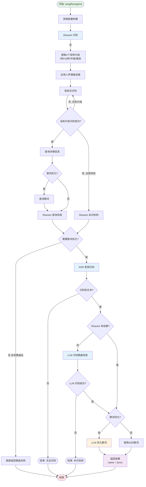

# 介绍

## 初始化

设置默认添加了千问的供应商，你仅需要配置key即可开始使用，首先查看[官方文档](https://help.aliyun.com/zh/model-studio/first-api-call-to-qwen)进行注册，拿到key后在“设置->AI配置->供应商”阿里云中并配置相关的key，由于我主要使用qwen进行开发，其他模型的兼容性未经过测试，如果有更多模型的支持，欢迎PR

接下来会介绍相关的一些功能。

## 歌切

位于切片右键选项中，为了此功能而引入的AI，目标是更快更好得识别音乐名称以及生成歌词

#### 流程图

```mermaid
flowchart TD
    Start([开始: songRecognize]) --> GetConfig[获取配置参数]
    GetConfig --> Shazam[Shazam 识别]

    Shazam -->|否| ExtractSegments[提取4个采样片段<br/>0秒/10秒/中段/尾段]

    ExtractSegments --> ApplyFilter[应用人声增强滤镜]
    ApplyFilter --> ProgressiveRecognize[渐进式识别]
    ProgressiveRecognize --> RecognizeLoop{当前片段识别成功?}
    RecognizeLoop -->|是| QueryInfo[查询详细信息]
    RecognizeLoop -->|否, 还有片段| ProgressiveRecognize
    RecognizeLoop -->|否, 全部失败| NoShazamResult[Shazam 未识别到]

    QueryInfo --> CheckLyricNeeded{歌词优化?}
    CheckLyricNeeded -->|是| QueryLyrics[查询歌词]
    CheckLyricNeeded -->|否| ShazamDone[Shazam 查询完成]
    QueryLyrics --> ShazamDone

    ShazamDone --> CheckOptimize{需要歌词优化?}
    NoShazamResult --> CheckOptimize

    CheckOptimize -->|否 且有歌曲名| ReturnName[直接返回歌曲名称]
    CheckOptimize -->|是| ASR[ASR 音频识别]

    ASR --> CheckASRText{识别到文本?}
    CheckASRText -->|否| End1([结束: 无法识别])
    CheckASRText -->|是| CheckShazamResult{Shazam 有结果?}

    CheckShazamResult -->|否| LLM[LLM 识别歌曲信息]
    CheckShazamResult -->|是| CheckLyrics{歌词优化?}

    LLM --> LLMResult{LLM 识别成功?}
    LLMResult -->|否| End2([结束: 未识别到])
    LLMResult -->|是| CheckLyrics

    CheckLyrics -->|是| OptimizeLyrics[LLM 优化歌词]
    CheckLyrics -->|否| NoLyrics[使用ASR歌词]

    OptimizeLyrics --> ReturnResult[返回结果<br/>name + lyrics]
    NoLyrics --> ReturnResult
    ReturnName --> End3([结束])
    ReturnResult --> End3
    End1 --> End3
    End2 --> End3

    style Start fill:#e1f5e1
    style End3 fill:#ffe1e1
    style Shazam fill:#e3f2fd
    style ASR fill:#e3f2fd
    style LLM fill:#e3f2fd
    style OptimizeLyrics fill:#fff3e0
    style ReturnResult fill:#f3e5f5
```

## 字幕识别 && 歌词识别

位于切片右键选项中，目标就是为切片生成字幕了，逻辑也十分简单，将片段音频喂给asr引擎，拿到词级时间戳进行排版

### 字幕识别 && 歌词识别 有何区别

在某些接口中，字幕识别会主动过滤掉音乐片段，歌词识别则不会

### ffmpeg 的 Whisper 支持

由于 ffmpeg8.0 支持了[whispercpp](https://github.com/ggml-org/whisper.cpp)，但是本软件支持的只是7.1，由于8.0要求的cuda版本较高可能造成大量n卡硬件编码错误，所有软件本体的ffmpeg版本暂时不会更新。

但我仍然为想要使用的用户提供了渠道，只是需要一些额外的配置。

第一步的相关你也可以直接在[夸克网盘](https://pan.quark.cn/s/6da253a1ecb8)下载。

不推荐在歌词识别中使用~~当然你也识别不出什么~~，如果出现什么不能使用gpu加速也别来问我，我也不知道

#### 配置步骤

1. **下载 ffmpeg 8.0 和 Whisper 模型**
   - 下载 ffmpeg 8.0 版本（或从[夸克网盘](https://pan.quark.cn/s/6da253a1ecb8)获取）
   - 下载 Whisper 模型文件（[huggingface.co/ggerganov/whisper.cpp](https://huggingface.co/ggerganov/whisper.cpp)）
   - **推荐使用大参数模型**（如 `ggml-large-v3.bin`）以获得更好的识别效果
   - **后两步的路径中如包含空格或一些奇怪字符，可能会导致无法使用**

2. **配置供应商**
   - 打开：设置 -> AI配置 -> 供应商
   - 点击"添加供应商"
   - **供应商类型**：选择 `ffmpeg`
   - **配置名称**：自定义名称（如 "FFmpeg Whisper"）
   - **API Key**：随意填写（不会被使用）
   - **Base URL**：填写 ffmpeg 可执行文件的**完整路径**（如 `C:\ffmpeg\ffmpeg.exe`）

3. **添加模型配置**
   - 切换到"模型"选项卡
   - 点击"添加模型"
   - **供应商**：选择刚才创建的 ffmpeg 供应商
   - **模型名称**：填写 Whisper 模型文件的**完整路径**（如 `C:\models\ggml-large-v3.bin`）
   - **标签**：勾选 `ASR`
   - **备注**：可选，填写说明（如 "本地 Whisper 大模型"）

## 直播总结

录制完成后可以基于视频中的语音自动生成直播总结。开启位置：设置 -> AI配置 -> 功能 -> 直播总结。

处理流程：

1. 从录制完成的视频中提取 16k 单声道 MP3 音频。
2. 使用配置的 ASR 模型生成带时间戳的转写文本。
3. 使用配置的 LLM 模型基于转写内容生成 Markdown 总结。
4. 总结结果写入直播历史记录，可在直播历史列表的“AI总结”列查看。

如果启用“保存转写”，会在视频同目录生成 `.transcript.txt` 文件。长直播会按配置的最大输入长度截断后再发送给 LLM，避免上下文超限。

### 导出总结

直播总结支持在生成完成后追加写入外部文档。开启位置：设置 -> AI配置 -> 功能 -> 直播总结。

如果已在“设置 -> 通知”中配置通知方式，导出完成后会发送“直播总结已生成”通知，通知内容包含本次生成后的飞书文档链接和 Notion 页面链接。可使用飞书机器人、企业微信机器人、Server酱等通知方式接收。

#### 飞书云文档

配置项：

1. `导出方式`：
   - `追加到已有文档`：总结会追加写入指定飞书 `docx` 文档。
   - `在文件夹中新建文档`：每次总结生成后，会在指定云空间文件夹中新建 `docx` 文档，再写入总结。
2. `App ID`：飞书开放平台企业自建应用的 App ID。
3. `App Secret`：同一个应用的 App Secret。
4. `文档 ID/链接`：追加模式使用。可以填写完整的飞书 `docx` 文档链接，也可以直接填写链接中 `/docx/` 后面的 Document ID。
5. `文件夹 Token/链接`：新建文档模式使用。可以填写完整的飞书云空间文件夹链接，也可以直接填写链接中 `/drive/folder/` 后面的 folder token。
6. `文档标题模板`：新建文档模式使用。支持 `{room}`、`{streamer}`、`{roomId}`、`{title}`、`{platform}`、`{time}` 变量，默认 `{room} - {time}`。

注意事项：

1. 飞书应用需要开通云文档读写相关权限，并确保应用有目标文档的访问权限。
2. 追加模式会把内容写到目标文档末尾；新建文档模式会先创建文档，再写入总结内容。
3. 当前会把 Markdown 总结转换为飞书文档块，支持标题、普通段落、无序列表和有序列表。

#### Notion

配置项：

1. `导出方式`：
   - `追加到已有页面`：总结会追加写入指定 Notion 页面。
   - `新建子页面`：每次总结生成后，会在指定父页面下新建子页面，再写入总结。
2. `Token`：Notion Internal Integration Token。
3. `页面 ID/父页面链接`：可以填写 Notion 页面链接，也可以直接填写页面 ID。追加模式会写入该页面；新建子页面模式会把该页面作为父页面。
4. `页面标题模板`：新建子页面模式使用。支持 `{room}`、`{streamer}`、`{roomId}`、`{title}`、`{platform}`、`{time}` 变量，默认 `{room} - {time}`。

注意事项：

1. 需要先创建 Notion integration，并将目标页面分享给该 integration。
2. 追加模式会把内容写到目标页面末尾；新建子页面模式会先创建子页面，再写入总结内容。
3. 当前会把 Markdown 总结转换为 Notion blocks，支持标题、普通段落、无序列表、有序列表和分割线。
