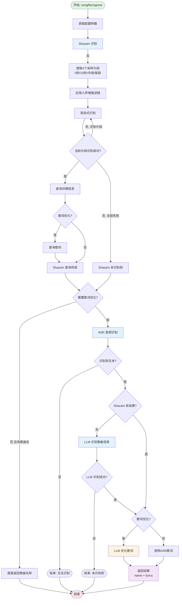

# 视频切片

根据弹幕和高能进度条快速定位精彩片段，支持批量导出，兼容 lossless-cut 项目。

## 功能介绍

视频切片功能可以帮助你：

- 快速找到精彩片段
- 根据弹幕密度定位高能时刻
- 批量导出多个片段
- 无损切割视频

## 快速开始

### 打开切片工具

1. 打开"工具" -> "视频切片"
2. 加载视频文件
3. 加载弹幕文件（可选）
4. 开始标记片段

::: tip 导入视频
尽量使用MP4容器，兼容性最好
:::

### 基本操作

1. **播放视频**：点击播放按钮或按 `Space`
2. **标记起点**：按 `I` 键
3. **标记终点**：按 `O` 键
4. **添加片段**：起点和终点都标记后自动添加
5. **导出片段**：按 `Ctrl+Enter`

## 界面说明

### 视频播放器

- 显示当前视频画面
- 支持拖拽进度条
- 显示当前时间和总时长

### 时间轴

- 显示视频完整时间轴
- 显示已标记的片段
- 显示高能进度条（如有弹幕）
- 显示弹幕密度分布

### 弹幕列表

- 显示当前时间附近的弹幕
- 点击弹幕跳转到对应时间
- 支持搜索弹幕内容

### 片段列表

- 显示所有已标记的片段
- 可以编辑片段名称
- 可以删除片段
- 可以调整片段顺序

## 快捷键

| 快捷键         | 功能                   |
| -------------- | ---------------------- |
| `Space`        | 播放/暂停              |
| `I`            | 标记当前时间为片段起点 |
| `O`            | 标记当前时间为片段终点 |
| `Up`           | 跳转到上一个片段       |
| `Down`         | 跳转到下一个片段       |
| `Del`          | 删除当前片段           |
| `Ctrl+Left`    | 后退1秒                |
| `Ctrl+Right`   | 前进1秒                |
| `Ctrl+S`       | 保存项目               |
| `Ctrl+Shift+S` | 另存为项目             |
| `Ctrl+Enter`   | 导出片段               |
| `Ctrl+Z`       | 撤销                   |
| `Ctrl+Shift+Z` | 重做                   |
| `Ctrl+K`       | 打开弹幕搜索           |
| `Ctrl+Shift+K` | 关闭弹幕搜索           |

## 使用弹幕定位

### 高能进度条

加载弹幕后，会自动生成高能进度条

点击高能区域快速跳转。

### 弹幕搜索

按 `Ctrl+K` 打开弹幕搜索：

1. 输入关键词
2. 显示包含关键词的所有弹幕
3. 点击弹幕跳转到对应时间

### 弹幕密度图

时间轴上显示弹幕密度分布，帮助快速定位高能时刻。

## 导出设置

### 导出选项

#### 单独导出

将每个片段导出为单独的文件。

::: tip 无损切割
选择原格式导出时，使用 `copy` 模式，不重新编码，速度快且无质量损失。
:::

#### 合并导出

将所有片段合并为一个文件。

#### 包含弹幕

导出时同时导出对应的弹幕文件（需要加载了弹幕）。

将弹幕压制到视频中。

::: tip
如果需要压制弹幕，则不能使用copy预设
:::

#### 自定义输出目录

指定导出文件的保存位置。

## 项目管理

### 保存项目

按 `Ctrl+S` 保存项目，会生成一个 `.llc` 文件（lossless-cut 项目格式）。

项目文件包含：

- 视频路径
- 弹幕路径
- 所有片段信息
- 导出设置

### 打开项目

1. 打开切片工具
2. 点击"打开项目"
3. 选择 `.llc` 文件

### 导入 lossless-cut 项目

完全兼容 [lossless-cut](https://github.com/mifi/lossless-cut) 项目格式：

1. 在 lossless-cut 中创建项目
2. 导出项目文件
3. 在 biliLive-tools 中打开

## 使用场景

### 场景1：提取精彩片段

1. 观看高能进度条
2. 跳转到高能时刻
3. 标记精彩片段
4. 批量导出

### 场景3：制作合集

1. 从多场直播中提取片段
2. 保存为项目
3. 统一导出

### 场景4：根据关键词提取

1. 搜索特定关键词弹幕
2. 查看对应视频内容
3. 标记相关片段

## 歌切

目标是更快更好得识别音乐名称以及生成歌词，仅对阿里系AI进行过测试，欢迎PR

## 高级技巧

### 1. 精确定位

使用 `Ctrl+Left/Right` 进行精确定位：

- 粗略定位：拖拽进度条
- 精确定位：使用快捷键逐帧调整

### 2. 批量处理

1. 一次性标记所有片段
2. 统一设置导出参数
3. 批量导出

### 3. 保存临时项目

即使还没完成标记，也要定期保存项目，避免意外丢失。

### 4. 使用弹幕辅助

弹幕是最好的精彩时刻指示器：

- 突然增多：可能有高能内容
- 刷屏：可能有精彩瞬间
- 特定关键词：如"卧槽"、"6666"

### 5. 预览片段

导出前可以先预览：

1. 点击片段
2. 按 `Space` 播放
3. 确认无误后再导出

## 性能优化

### 快速导出

使用无损切割（原格式导出）：

- 不重新编码
- 速度快
- 无质量损失
- 但可能不精确（取决于关键帧位置）

### 精确导出

使用重新编码：

- 精确到帧
- 可以修改格式
- 可以压制弹幕
- 但速度慢

## 故障排除

### 视频无法加载

1. 检查视频格式是否支持
2. 检查视频文件是否损坏
3. 尝试转换为MP4格式

### 弹幕无法加载

1. 检查弹幕文件是否为XML格式
2. 检查文件编码是否为UTF-8
3. 检查弹幕文件是否完整

### 导出失败

1. 检查硬盘空间是否充足
2. 检查输出目录是否有写入权限
3. 查看日志获取详细错误

### 导出的视频时长不对

使用无损切割时，切割点可能不精确（取决于关键帧位置）。

解决方案：

- 使用重新编码模式
- 或手动调整切割点到附近的关键帧

### 快捷键不生效

确保焦点在视频播放器上，不在输入框中。

## 最佳实践

### 1. 先浏览再切片

第一遍先快速浏览，标记大致位置。
第二遍再精确调整切割点。

### 2. 合理命名片段

为片段添加描述性名称，方便管理：

- ❌ 片段1、片段2
- ✅ 击杀五人、团战获胜

### 3. 定期保存

每标记几个片段就保存一次，避免意外丢失。

### 4. 批量处理

一次性标记所有需要的片段，然后统一导出，提高效率。

### 5. 备份项目

重要的切片项目要备份，避免误删。

## 相关工具

### lossless-cut

[lossless-cut](https://github.com/mifi/lossless-cut) 是一个专业的视频切片工具，biliLive-tools 完全兼容其项目格式。

可以在两个工具之间切换使用。
